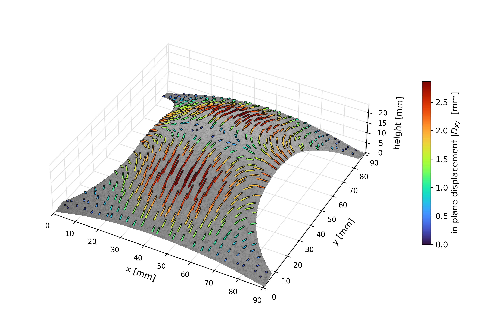
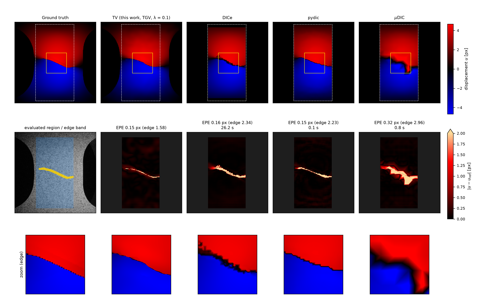

# Nakajima Virtual Lab

A Unity-based virtual laboratory for the **quantitative evaluation of image-based displacement, strain, and stereo
reconstruction** in sheet-metal forming. The lab renders camera images of a Nakajima forming test whose surface
deformation comes from a finite-element simulation, estimates the displacement with a GPU optical-flow solver
(TV-L1 / TGV), reconstructs depth and three-dimensional displacement from two cameras, and compares every result
pixel by pixel with an exact reference field derived from the simulation mesh.

This repository accompanies the manuscript

> P. F. Richter et al., *A Virtual Nakajima Forming Case Study for Quantitative Evaluation of Image-Based
> Displacement and Stereo Reconstruction* (under review).

<p align="center">
  <br>
  <em>Reference surface of the deformed Nakajima dome with the in-plane part of the three-dimensional displacement
  reconstructed from both virtual cameras.</em>
</p>

---

## Contents

- [Features](#features)
- [Repository layout](#repository-layout)
- [Requirements](#requirements)
- [Quick start](#quick-start)
- [Documentation](#documentation)
- [Data](#data)
- [Reproducing the manuscript](#reproducing-the-manuscript)
- [Limitations](#limitations)
- [Citation](#citation) · [License](#license) · [Contact](#contact)

---

## Features

**Virtual experiment**
- Import of deformed sheet surfaces for every output step of a forming simulation (plain-text nodal coordinates;
  LS-DYNA was used here, other solvers work after export, see [data formats](docs/data_formats.md)).
- Two virtual cameras (stereo rig), laboratory lamps, speckle textures (photographed, experiment-derived,
  or procedural patterns of prescribed speckle size), rendered with Unity's High Definition Render Pipeline.
- Controlled image degradations: illumination factor, 8-bit exposure scaling, and Poisson photon shot noise.

**Measurement**
- Dense optical flow with a GPU implementation of TV-L1 and of its second-order extension TGV
  (compute shaders, coarse-to-fine pyramid with warping); a CPU reference implementation is included.
- Strain fields from the displacement (Gaussian-smoothed gradients).
- Stereo depth by linear (DLT) triangulation directly from the Unity camera matrices.
- Three-dimensional displacement field from both cameras (stereo correspondence in the first frame plus temporal
  flow in both cameras), expressed in stereo-rig coordinates.

**Ground truth and evaluation**
- Exact reference displacement, depth, and 3D displacement from the simulation mesh (ray casting per pixel,
  barycentric material-point tracking between frames), verified by built-in self-tests
  (pixel-centre round trip ~4e-4 px, triangulation self-test 0 mm).
- Error maps, statistics, and automated parameter studies (sweeps) over illumination, shot noise, speckle size,
  exposure, and numerical parameters; results are written as TSV tables and raw float maps.
- Comparison with established open-source DIC codes (DICe, pydic, µDIC) at a large deformation-gradient region.

**User interface**
- In-application control panel with tabs (Analysis, Sweeps, Stereo, Real image), hover explanations for every
  control, and a zoomable image gallery with per-analysis result reports.

<p align="center">
  <br>
  <em>Displacement at a large deformation-gradient region: reference, TV estimator, DICe, pydic, and µDIC.</em>
</p>

## Repository layout

```
Assets/
  vis_3D.cs                  main controller: scene setup, rendering, optical flow, ground truth, studies
  TvL1Gpu.cs, TgvL1Gpu.cs    GPU solvers (one pyramid level) for TV-L1 and TGV
  Resources/TVL1.compute     compute shaders of the solvers
  Resources/TGVL1.compute
  ExperimentImageGallery.cs  control panel, tooltips, image gallery, result reports
  HoverTip.cs, ResolutionSlider.cs, NakajimaRealImageComparison.cs, ...   UI and helpers
  *.cs                       smaller scripts of the scene UI (paths, series, switches, buttons)
  Scenes/SampleScene.unity   the virtual lab scene
  HDRPDefaultResources/      render-pipeline settings
Packages/, ProjectSettings/  Unity project configuration (Unity 6000.6.2f1, HDRP 17.6)
scripts/                     Python tools: figures, analyses, mesh conversion, DIC comparison
results/                     result tables of the manuscript (reference values)
docs/                        documentation (see below)
```

Large inputs (meshes, 3D models of the laboratory, textures) are not stored in git; see [Data](#data).

## Requirements

| Component | Version / note |
|---|---|
| Unity Editor | **6000.6.2f1** (Unity 6), High Definition Render Pipeline 17.6 (installed via the package manifest) |
| Operating system | Windows 10/11 (developed and tested); other platforms untested |
| GPU | DirectX 11/12 GPU with compute-shader support (a CPU fallback exists but is much slower; TGV is GPU-only) |
| Python (optional) | 3.11 or newer with `numpy`, `matplotlib`, `pillow` for the figure and analysis scripts |
| DIC comparison (optional) | separate environment with `muDIC`, `opencv-python`, `scipy`; pydic and DICe, see [docs/dic_comparison.md](docs/dic_comparison.md) |

## Quick start

1. **Clone** the repository and download the **data archive** (meshes, models, textures) into the project folder as
   described in [docs/installation.md](docs/installation.md).
2. Open the folder with **Unity Hub** (Editor 6000.6.2f1). The first import takes a few minutes.
3. Open `Assets/Scenes/SampleScene.unity` and press **Play**.
4. Top right, tick `with_exp` (render images) and `with_tv` (compute optical flow), choose a resolution, and press
   **Start**. The default analysis renders frames 1 and 27 of the forming sequence and computes the flow.
5. Open the tab **Analysis** in the control panel on the right and press **Genauigkeit** (accuracy): the gallery
   shows the displacement, the reference, and the error maps together with a statistics report.
6. Parameter studies are started from the tab **Sweeps**, stereo depth and 3D displacement from the tab **Stereo**.
   Hover over any control to see what it does.

A complete walk-through of the interface and the workflows is given in the [user guide](docs/user_guide.md).

> The interface labels are German (e.g. *Neu* = new run, *Laden* = load last result, *Genauigkeit* = accuracy,
> *Höhe* = depth, *Licht* = illumination, *Rauschen* = noise). The user guide lists every control with an English
> explanation.

## Documentation

| Document | Content |
|---|---|
| [docs/installation.md](docs/installation.md) | Installation, data archive, Python environments, troubleshooting |
| [docs/user_guide.md](docs/user_guide.md) | Scene, control panel, all buttons and fields, typical workflows |
| [docs/methods.md](docs/methods.md) | Optical flow (TV-L1 / TGV), strain, stereo triangulation, 3D displacement, ground truth, error measures, conventions |
| [docs/data_formats.md](docs/data_formats.md) | Mesh input, image and result folders, raw float maps, TSV tables |
| [docs/reproducing_the_paper.md](docs/reproducing_the_paper.md) | Figure-by-figure instructions for the manuscript |
| [docs/dic_comparison.md](docs/dic_comparison.md) | Running DICe, pydic, and µDIC on the rendered images |
| [docs/architecture.md](docs/architecture.md) | Code structure for developers |

## Data

The following inputs are too large for git and are provided as a separate archive:

| Folder | Content | Size |
|---|---|---|
| `Assets/verts/` | deformed sheet surface for each simulation output step (`verts_<n>.txt`) | ~430 MB |
| `Assets/Resources/Targets/`, `Assets/Resources/blender_data/` | 3D models of the laboratory setup (desk, tools) | ~1.1 GB |
| `Assets/cam00/` | speckle textures (photographed, experiment-derived, procedural) and the reference photograph | ~640 MB |
| `Assets/nakajima_full_angle/` | additional geometry of the Nakajima setup | ~85 MB |

**Download:** *link to the archived data set (to be added before publication).*

The procedural speckle textures can also be regenerated with `scripts/make_procedural_speckles.py`, and meshes from
any finite-element solver can be converted with `scripts/stl2verts.py`. The finite-element solver itself is **not**
needed to use the lab.

## Reproducing the manuscript

Every quantitative figure of the manuscript is produced from tables and raw maps written by the lab, using the
scripts in `scripts/`. The tables used in the manuscript are included in `results/`. See
[docs/reproducing_the_paper.md](docs/reproducing_the_paper.md) for the exact sequence of runs and commands.

## Limitations

The lab is a controllable graphics pipeline, not a validated simulation of complete laboratory optics: the lens
point-spread function, aperture-dependent blur, and spectral response are not calibrated. The images of the
manuscript were rendered with the rasterized HDRP path (hardware ray tracing is available in HDRP but disabled in
this project). The large deformation-gradient region of the meshes is a stress test for image correspondence and not
a verified crack ground truth. See [docs/methods.md](docs/methods.md#limitations).

## Citation

If you use this software, please cite the manuscript above; citation metadata are provided in
[CITATION.cff](CITATION.cff).

## License

The source code in this repository is released under the [MIT License](LICENSE). Unity, the HDRP package, and
TextMesh Pro are subject to their own licenses. Third-party Asset Store content used during development is not part of
this repository.

## Contact

Paul Friedrich Richter, Technical University of Munich — paul.friedrich.richter@tum.de

An earlier, script-only version of this repository is preserved in the branch
[`v1-old`](https://github.com/Paul44444/Nakajima_virtual_lab/tree/v1-old).
